# Notre solution 

Un site internet avec le CMS Wordpresse 

## Le logo du site

Voici le logo qu'on a proposé aux clientes

## Nos maquettes 

Voici les maquettes que nous avons créées pour pallier ces contraintes.

Le menu en tête de page (header), comprend le logo que nous avons conçu pour l’image de Scentsoft, et les pages de fonctions principales que l’utilisateur pourra parcourir :

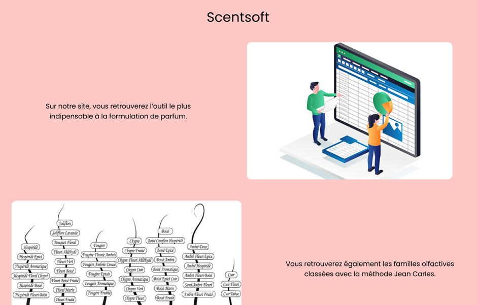

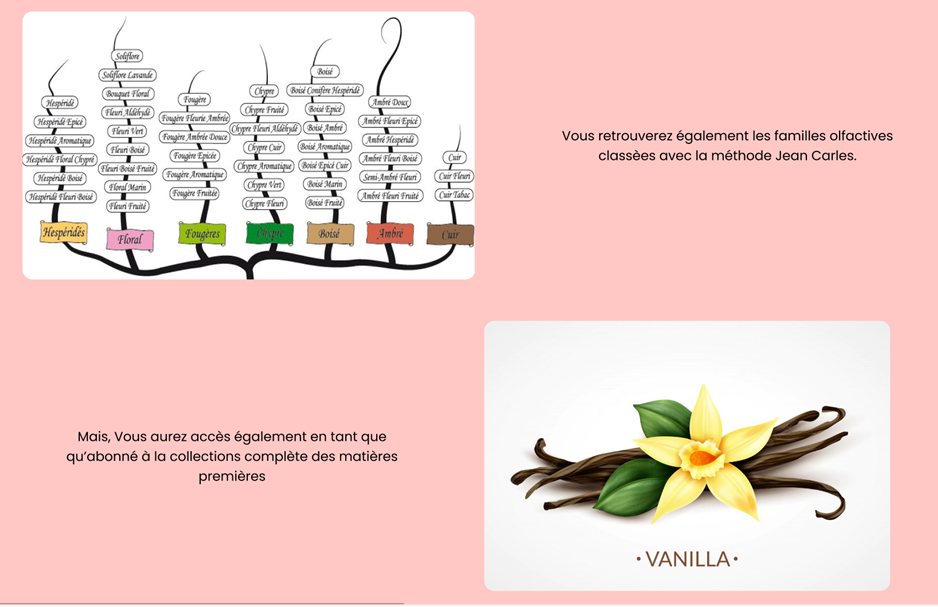

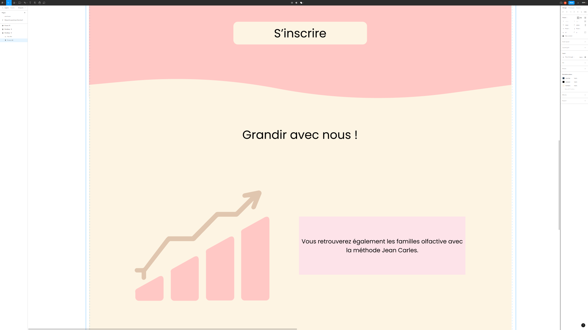

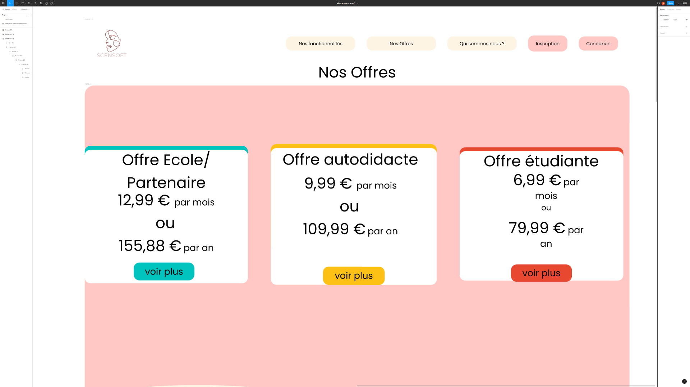

## Site effectif 

Le menu en tête de page (header), comprend le logo que nous avons conçu pour l’image de Scentsoft, et les pages de fonctions principales que l’utilisateur pourra parcourir : 

## La page d'accueil

La page d’accueil avec les avantages pour les apprentis parfumeurs, autodidactes et professionnels, de nous rejoindre et débuter avec l’outil Scentsoft :

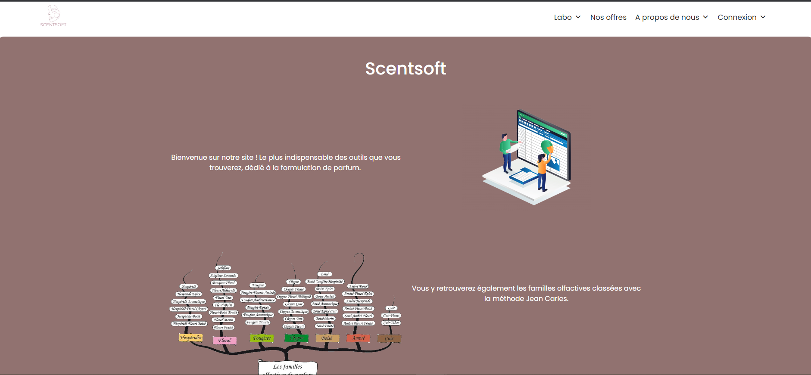

Un bouton “S’inscrire”, qui redirige directement vers la page d’inscription pour les utilisateurs ne possédant pas de compte sur le site : 

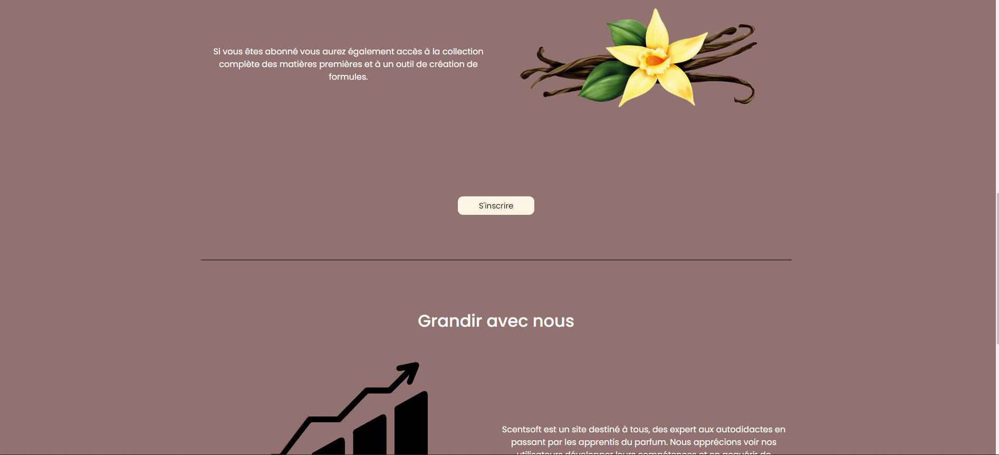

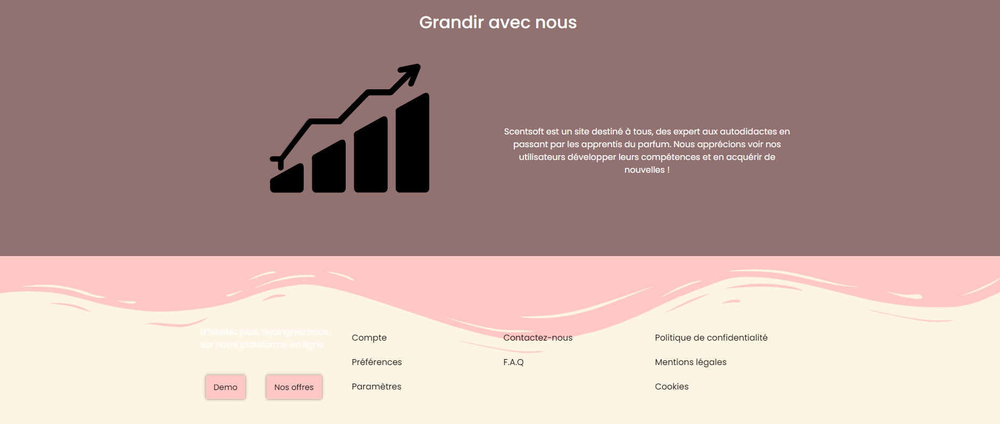

## La page des offres

La page affichant toutes les offres que l’on propose pour les utilisateurs selon leur statut, ainsi que des avis de clients ayant prit un abonnement :

## Le forum 

Le forum d’où les utilisateurs peuvent ouvrir un sujet s’ils le veulent et répondre à d’autres, il est obligatoire d’être connecté pour y avoir accès :

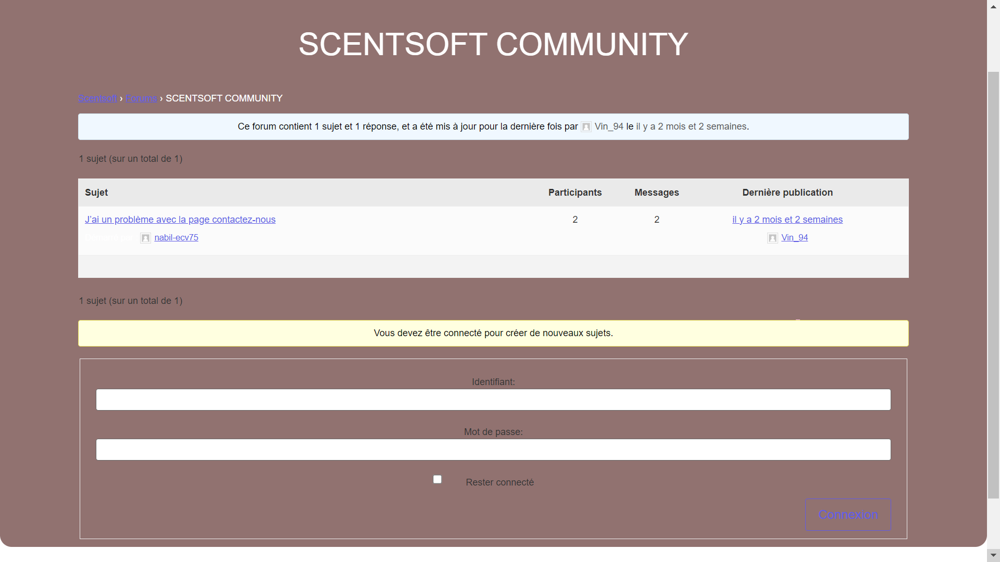

## Page d'inscription 

La page d’inscription dans laquelle les utilisateurs devront entrer certaines informations pour créer leur compte Scentsoft comme par exemple leur statut (Étudiant, Autodidacte, Professionnel/partenaire) : 

## Les extensions utilisées

**Approche technique** 

Voici quelques captures d’écran des différentes extensions que nous avons utilisées.
Pour développer le forum, nous avons utilisé l'extension bbpress. Nous utilisons également le plug-in Elementor pour pouvoir ajuster les pages, les modifier, ajouter des éléments, il fonctionne comme le plugin Gutenberg de l’éditeur Wordpress. Pour les formulaires, nous avons utilisé Ninja Form, une extension qui nous a permis de créer la page “contactez-nous”. 
Nous avons aussi utilisé wp-members est l’extension qui  permet aux utilisateurs de créer un compte ou de se connecter.
 

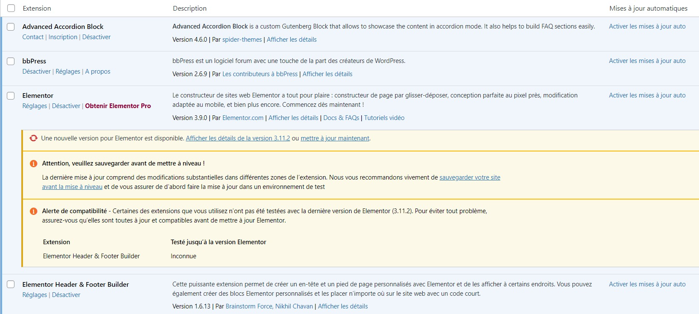
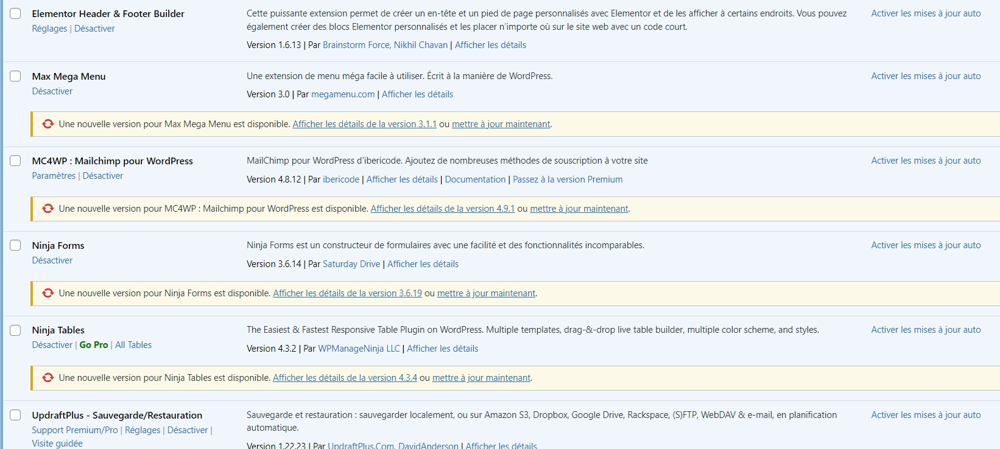
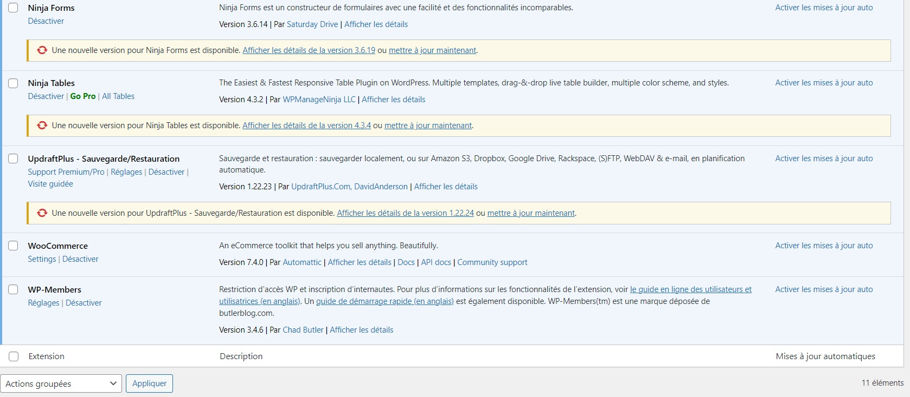

Nous avons installé le thème Royal Elementor Kit pour l’aspect de notre site internet. Nous avons dû ajouter du css afin d’avoir un rendu plus qualitatif en terme d’esthétique :

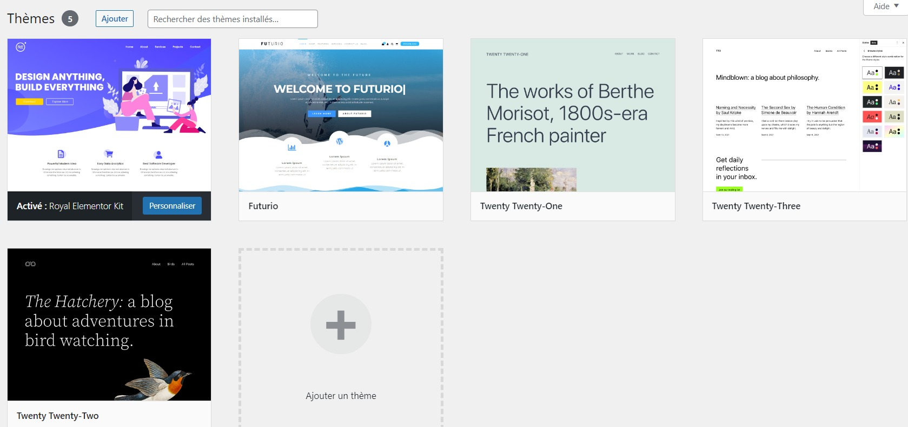