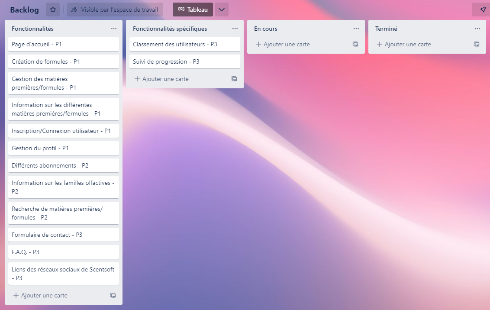

# Le Projet Scentsoft 

## Le Projet
Nous avons rencontré trois clientes qui sont Solène KITTLER, Daphné PERRYMAN-HOLT et Stephanie LIPP. Elles sont étudiantes en Master 2 à l’ESP (Ecole supérieure de parfumerie)
Le projet Scentsoft est une plateforme en ligne qui permet aux apprentis parfumeurs, autodidactes et professionnels, de réaliser, stocker, et partager des formules.

## Le groupe de travail
Nous sommes un groupe de deux développeurs web, qui se nomme NEH (Nabil et Helwan), notre particularité est d’aller jusqu’au bout de nos projets et de donner le meilleur de nous-même pour satisfaire nos clients, en leur apportant une vision technique qui nous permet de leur faire des propositions au besoin. Les attentes de nos clients, auprès de nous, sont de leur proposer un site web fonctionnel, ergonomique, et facile d’utilisation pour les apprentis parfumeurs, les autodidactes, et les professionnels.

## Le contexte

Ce projet est l’aboutissement de notre 3ème de bachelor en chef de projet digital. Il nous a été proposé par notre école afin de nous rendre polyvalent dans les trois notions de notre cursus : Marketing/Communication, UI/UX Design ainsi que développement web. Scentsoft nous a sollicité pour répondre à leurs besoins.

# Enjeux

## Problématique
Comment faciliter la création de parfums et la rendre accessible, et attrayante ?

## Objectifs

Pour se faire, il devra contenir trois grands axes de fonctionnalités :
La création et l’édition des formules.
L’olfaction, avec une sensibilisation aux différentes notes et odeurs, et une liste des matières premières classées à l’aide de la méthode Jean Carles (méthode empirique destinée au parfumeur en distinguant les matières premières naturelles des synthétiques).
Un forum qui permettra de faire évoluer une communauté qui pourra s’entraider et partager ses formules.

Pour s’assurer que le site web obtient le succès escompté, il faut mettre en place des KPI (key performance indicators), il en plusieurs mesurant tous des données différentes, nous en avons retenus quatre qui seraient les plus significatifs dans le cas de Scentsoft :
Le trafic (nombre total de visiteurs sur le site, nombre de visiteurs uniques, durée moyenne de session).
Le taux de conversion (de prospects à clients).
Le taux d'engagement (nombre de commentaires, partages, likes et temps passé sur le site).
Qualité (temps de chargement des pages, erreurs de chargement, liens fonctionnels).

Nous retrouvons ici la backlog avec les différentes fonctionalité classé par ordre de priorité de P1 a P3

